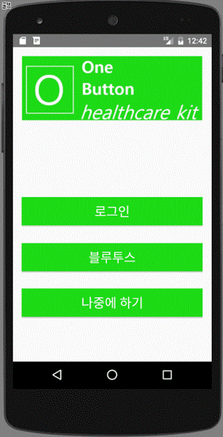

# OneButton-Healthcare-KIT

## 1. 연구의 필요성
### 가. 연구의 개요
#### 1) 사회 현상의 변화
* 고령화가 급속하게 진행되는 현대 한국 사회에서 고령 인구가 차지하는 비율은 증가하고 있으며, 이러한 영향력은 65세 이상의 고령 인구 비율의 증가와 더불어 더욱 증대될 것으로 전망됨.[1]

* 인구통계학적인 구조의 변화뿐만 아니라, 그동안의 경제성장 및 산업화에 따라 가족구조가 변화하고 있음. 3대가 함께 살았던 과거의 가족구조와 달리 현대에는 주로 부모와 자식, 이마저도 자녀가 성인이 되면 부모와 떨어져 생활하는 가족구조를 보임. 이러한 현상은 ‘핵가족화’라는 용어로 정리할 수 있으며 이러한 핵가족화를 고령화와 연관 지어 보았을 때 사회적인 문제로 받아들일 필요가 있음.

    
     _[그림 1] 노인 가족 형태의 변화 추이 (보건사회연구원, 2011)_

#### 2) 기술의 변화를 따르지 못하는 계층
* 스마트폰의 기능이 빠른 속도로 발전하고 있음. 그러나 그 기능을 정확히 이해하고 개발자의 의도에 맞게 사용하는 사용자는 극히 일부임. 따라서 불필요한 복잡한 기술보다는 간단한 조작으로도 스마트폰을 사용할 수 있도록 해주는 기술이 필요하다고 판단함.
* 스마트폰을 원하는 대로 사용할 수 있는 젊은 계층은 일반적으로 건강 상태가 비교적 건강함. 하지만 건강 상태의 모니터링이 필요한 장․노년층은 정작 스마트폰을 원하는 대로 사용하는 데 어려움을 느낌.
* 아래의 그래프에서 알 수 있듯 장․노년층이 정보 격차를 겪고 있는 가장 큰 이유는 스마트폰의 이용 용도를 모르기 때문인 것으로 확인됨. 계층의 특성상 그들에게 스마트폰 사용법에 대한 교육을 하는 것보다 그들을 위한, 간단한 조작으로도 원하는 것을 할 수 있는 기술을 제공해야함.

  
   _[그림 2] 장․ 노년층 정보 격차 실태조사(정보화진흥원,2013)_

#### 3) 연구의 목표
* 위와 같은 요인을 바탕으로 기계(스마트폰)의 조작에 능숙하지 못한 계층이 스스로의 건강 상태를 수시로 모니터링하고, 외부의 사람들도 특정 사용자의 건강 상태를 모니터링 할 수 있는 시스템을 구축하고자 함.
* 본 연구의 방향은 크게 세 가지로 나누어짐. 스마트폰 외부에 오직 하나의 버튼을 통해 스마트폰 조작에 어려움을 느끼던 사용자에게 단순하지만 확실한 방법을 제시하고, 해당 버튼에 측정을 시작하는 기능을 부여하여 사용자가 애플리케이션의 기능과 외부 기기의 기능을 직관적으로 알 수 있도록 함.
* 다음은 공유기능으로 사용자가 간단한 측정을 하게 되면 그 결과가 서버에 있는 데이터베이스에 축적이 되고, 외부 사용자가 측정자의 결과를 열람할 수 있도록 함.
* 마지막으로 측정을 위해 필요한 구조, 즉 원 버튼 형태와 측정 장비를 하나의 유닛으로 구성하여 시중에 판매되고 있는 구급함과 같은 기능을 하도록 하고자 함.

  
   _[그림 3] 기기의 주요 기능에 대한 모식도_

  ### 나. 국내․외 연구 동향
  #### 1) 국내 연구 동향

연구자 | 저널명 | 시기 | 제목 및 내용
---|---|---|---|---
이선희,유선실 | 『정보통신방송정책』|2014|모바일 헬스케어 애플리케이션 현황 및 전망     - 무선통신과 웨어러블 스마트기기의 확산 및 바이오센서 기술의 발달로 모바일 헬스 케어 기술이 주목받고 있음  - 수많은 건강 관련 애플리케이션이 이미 기존에 보급되어 있지만, 이용자의 습관과 행동을 형성하는 것이 실패하였기 때문에, 이용자의 사용 동기를 유발하지 못하고 있다는 것을 문제점으로 삼고 있음.
이다영 외 2명 | 디지털 디자인학 연구 |2014 | 40,50세대를 위한 모바일 인터페이스 고찰   - 장․노년층이 스마트폰을 이용하고 학습하는 데 있어서 어려움을 호소하고 있음 - 신체적인 원인으로 시력이 저하되어 스마트폰 화면을 보는 데 문제가 있음  - 이를 통해 이용 연령 층에 맞는 인터페이스의 개발이 필요함을 확인함

#### 2) 국외 연구 동향

연구자 | 저널명 | 시기 | 제목 및 내용
---|---|---|---|---
Nilay Kumar, and others | Journal of the American Society of Hyperten- sion(JASH) | 2014 | • Are video sharing Web sites a useful source of information on hypertension?  - 해당 연구팀이 분석한 107개의 혈압을 측정하는 애플리케이션이 전문적인 검증을 받지 않은 것으로 확인됨.  - 많은 애플리케이션들이 헬스 케어라는 유행에 편승하여 실제로 검증되지 않은 기술을 앞세워 의료적 측정을 할 수 있다고 광고함. - 이것은 사용자로 하여금 스스로의 건강에 대해 잘못 진단할 수 있는 위험성이 있음. -  일부 안드로이드 애플리케이션은 혈압 측정을 위해 스마트폰의 화면이나 카메라를 손가락으로 누르기만 하면 된다고 주장하고 있음. - 따라서 보다 정확한 측정 결과를 제시하는 애플리케이션의 필요성이 강조됨.

### 다. 연구의 필요성 및 중요성
* 모바일 헬스 케어 애플리케이션 현황 및 전망에 대한 연구에서 밝혀진 바 있듯 수많은 헬스 케어 애플리케이션들이 쏟아져 나오고 있고, 다양한 기능이 있음. 하지만 기능들이 특정 개인에게 한정되어 있어, 사용자의 지속적인 이용을 이끌어 내는 데 실패함.
* 이에 주목하여, 개인의 건강상태를 개인이 속해있는 집단의 관심거리로 만들어 흥미를 유발하고 애플리케이션의 사용성이 지속적으로 유지될 수 있도록 하는 데 초점을 맞춤.
* 40, 50세대를 위한 모바일 인터페이스 고찰 논문에서 언급된 것과 같이 헬스 케어 애플리케이션을 보급하려고 해도 정작 건강관리에 관심이 많은 중․장년층은 스마트폰 애플리케이션을 이용하는 데 어려움을 겪고있음.
* 하나의 버튼(One Button)을 도입하면 건강 상태를 측정하는 것과 공유하는 것이 용이함. 이에 따라 해당 기술이 필요한 사람들에게 보급되므로 기술의 의미가 더해질 것으로 기대됨.
* 본 연구에서는 스마트폰에 내제되어있는 센서를 사용하는 것이 아닌 외부 장비를 자유롭게 추가할 수 있도록 하여, 보다 정밀한 측정 결과를 제공하고, 측정 분야를 확장할 수 있도록 함.

## 2. 연구목표의 창의성(원천성)․도전성

* 본 연구에서는 공유 기능과 원버튼을 통한 이용의 편리성에 초점을 맞추어 애플리케이션을 개발함.
* 아래의 표는 기존에 시중에서 판매되고 있는 ‘s헬스’ 애플리케이션과 ‘상태 모니터’ 애플리케이션과의 차별성을 보여줌

| s헬스 | 상태 모니터 | Easy Healthcare Kit
---|---|---
지도지원|o|x|o
심박계지원|o|o|x
혈압계지원|o|o|o
집단공유기능|o(걸음수만 가능)|x|o
긴급전화|x|x|o
단순한 동작|x|x|o(원버튼)
사용 대상|일반인|일반인|정보취약계층 및 일반인

### 가. 정밀한 측정 가능

* 종래의 시스템의 방식은 스마트폰에 내제되어있는 센서만을 활용하여 측정하는 방식으로, 사용자가 측정을 할 때 센서를 직접 눈으로 확인할 수 없으므로 측정에 대해 신뢰를 하지 못하는 경우가 있음.
* 본 연구의 시스템 방식은 쉽게 다룰 수 있는 펌 웨어 중 Arduino를 기반으로 하여 Arduino Sensor kit를 연결하여 측정하는 방식으로, 이전의 방식과 다르게 외부에 측정 장치를 두어, 사용자로 하여금 측정 상황을 인지할 수 있도록 함.

  
 _[그림 4] 스마트폰에 내제되어있는 일반적인 센서_
  
 _[그림 5] Arduino에 연결하여 사용하는 온습도 센서_

### 나. 측정 기기의 확장 가능

* 앞에서 언급한 온습도 센서(DHT11) 하나를 사용하기 위해서는 접지연결, 전원연결, 신호연결이 필요한데, 이 때 신호연결을 위해 하나의 포트가 소비됨.
* 따라서 Arduino Board와 호환이 가능한 센서를 연결하면 보다 넓은 분야의 생체 신호 측정이 가능할 것으로 기대됨.
  
 _[그림 6] Arduino Uno 보드_

## 3. 연구 목표 및 내용
### 가. 연차별 연구의 목표 및 내용
#### 1) 1차 분기
##### Ⅰ. 애플리케이션 구상 및 설계

## 4. 실제 구현된 화면 및 동작 화면
### 가.하이브리드 앱 구현을 통한 로그인 화면
* 웹 뷰를 통해서 JSP 구현된 로그인 시스템을 공유
* 로그인 시스템 공유를 통해 개발 기간 단축
  
  
 _[그림 7] 모바일 로그인 화면_
  
 _[그림 7] PC 로그인 화면_

### 나.이미지를 통해 동작 표현

 _[그림 7] 페이징을 통한 UI 구현_
